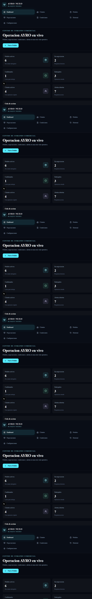
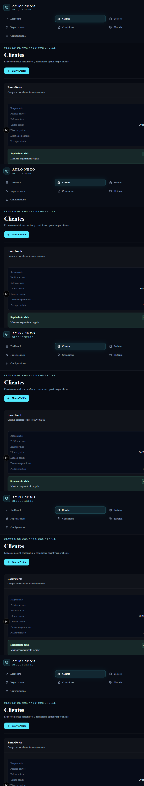
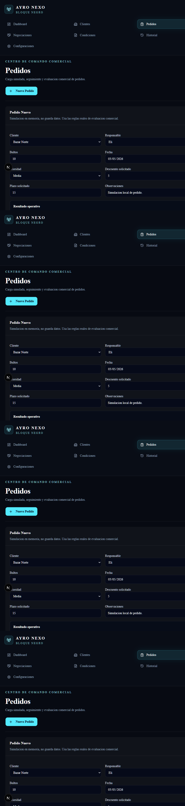
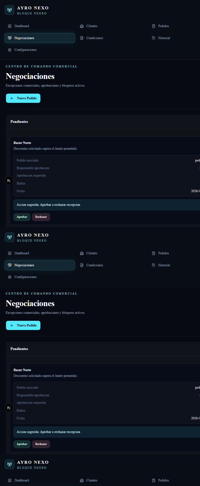
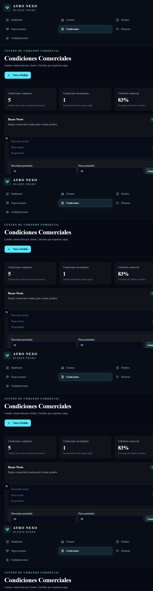
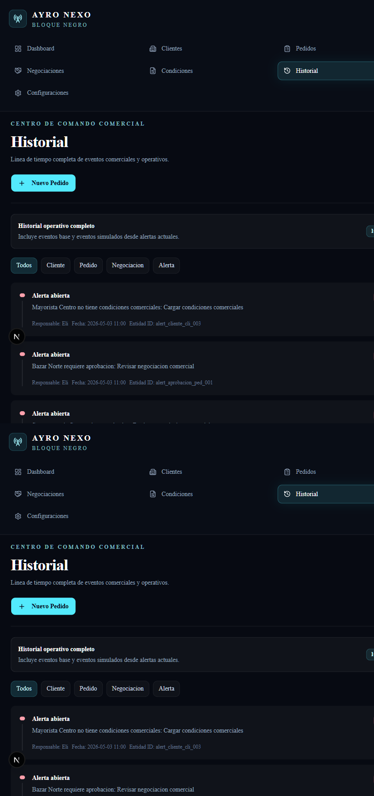
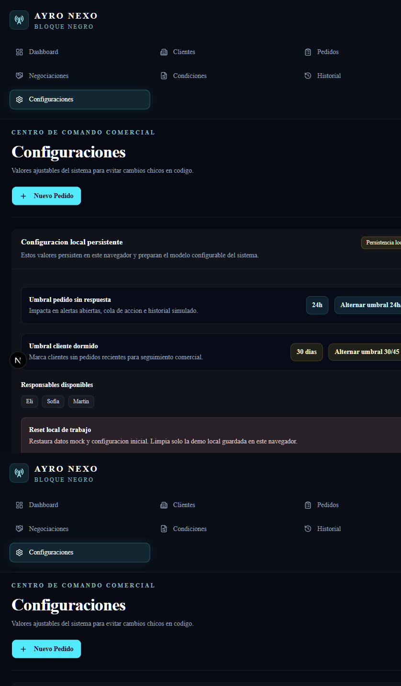

# AYRO NEXO - Demo Walkthrough

Este recorrido muestra el estado actual de AYRO NEXO como demo operativa persistente.

La demo sigue siendo frontend-first:

- no usa backend real;
- no usa base de datos;
- no usa autenticacion;
- persiste cambios en `localStorage`;
- mantiene la UI desacoplada de la fuente de datos mediante la capa `src/data`.

## 1. Dashboard operativo

Vista principal del centro de comando comercial: metricas, cola de accion, alertas, kanban e historial reciente.



## 2. Clientes y seguimiento comercial

La vista Clientes muestra condiciones, ultimo pedido, dias sin pedido y seguimiento de clientes dormidos para reactivar contacto comercial.



## 3. Pedidos operables

Pedidos permite simular evaluacion comercial, crear pedidos locales y mover estados operativos sin backend.



## 4. Negociaciones

Negociaciones agrupa excepciones por estado y permite aprobar o rechazar decisiones en la demo persistente.



## 5. Condiciones comerciales

Condiciones centraliza limites por cliente y permite modificar descuento/plazo para recalcular alertas y evaluaciones.



## 6. Historial operativo

Historial muestra eventos base y eventos locales generados por acciones de la demo.



## 7. Configuraciones y persistencia

Configuraciones muestra umbrales operativos, persistencia local activa, fuente actual y reset de datos locales.



## Como reproducir

Desde la raiz del repo:

```bash
npm run dev
```

Abrir:

```txt
http://localhost:3000
```

Tambien se puede iniciar con:

```powershell
.\iniciar-ayro-nexo.bat
```

## Nota de producto

Estas capturas muestran la demo actual. El siguiente salto no es agregar mas UI por volumen, sino consolidar Sprint 4.5:

- modelo operativo real;
- ordenes comerciales;
- proveedores;
- facturacion;
- direcciones logisticas;
- importacion segura de datos reales anonimizados;
- eliminacion progresiva de mocks irreales.
